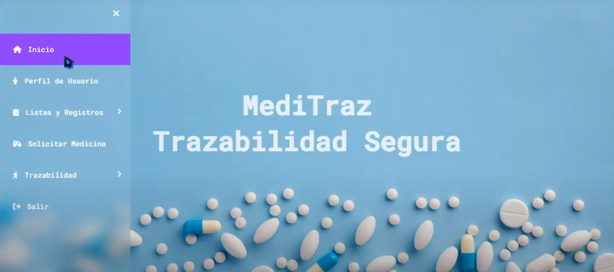
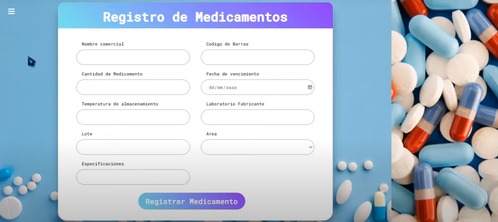
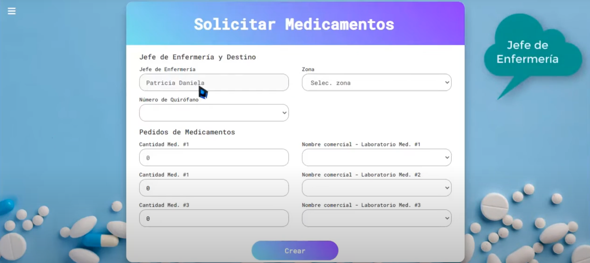

# Meditraz: Sistema de Trazabilidad de Medicamentos

## Descripción

Meditraz es una aplicación web diseñada como prototipo académico para la trazabilidad de medicamentos. Permite llevar un inventario digital de fármacos, registrar información detallada de cada medicamento, rastrearlo mediante código de barras, recibir alertas de caducidad y gestionar roles de usuario.

## Funcionalidades principales

* **Gestión de inventario:** Crear, editar y eliminar registros de medicamentos.
* **Trazabilidad por código de barras:** Escaneo y búsqueda rápida de productos.
* **Alertas de caducidad:** Notificaciones automáticas para medicamentos próximos a vencer.
* **Control de usuarios y roles:** Autenticación de usuarios con roles (administrador, farmacéutico).
* **Histórico de movimientos:** Registro de entradas y salidas de stock.

## Tecnologías utilizadas

* **Frontend:** Angular (SPA), HTML5, CSS3, TypeScript.
* **Backend (prototipo académico):** ASP.NET Core, API REST.
* **Base de datos:** SQL Server.
* **Control de versiones:** Git/GitHub.

> **Nota:** En el repositorio público se incluye principalmente el código del frontend en Angular. El backend se encuentra documentado en la publicación académica asociada.

## Instalación y ejecución

1. **Clonar el repositorio:**

   ```bash
   git clone https://github.com/bleon133/meditraz-angular.git
   cd meditraz-angular
   ```

2. **Instalar dependencias de Angular:**

   ```bash
   npm install
   ```

3. **Configuración de la API backend:**

* Asegúrate de tener una instancia de SQL Server en ejecución.
* Crea la base de datos `MeditrazDB` y ejecuta los scripts de inicialización (disponibles en la documentación académica).
* En el archivo `src/environments/environment.ts`, actualiza `apiUrl` con la URL de tu API ASP.NET Core.

4. **Levantar la aplicación Angular:**

   ```bash
   ng serve --open
   ```

   La aplicación estará disponible en `http://localhost:4200/`.

## Capturas de pantalla

<!-- Inserta aquí capturas de la interfaz: formularios de registro, listas de medicamentos, alertas de caducidad, etc. -->






## Origen académico

Este proyecto formó parte de un estudio de Ingeniería Biomédica de la Universidad Autónoma de Bucaramanga (UNAB). Los detalles de diseño, metodología y resultados se encuentran en la publicación:

> Pardo, A., & León, B. (2023). "Prototipo de sistema de trazabilidad de medicamentos basado en Angular y ASP.NET Core". *Repositorios Académicos UNAB*. Disponible en: [https://repository.unab.edu.co/bitstream/handle/20.500.12749/20899/2022\_Articulo\_Leon\_Martinez\_Brayan\_Steven.pdf](https://repository.unab.edu.co/bitstream/handle/20.500.12749/20899/2022_Articulo_Leon_Martinez_Brayan_Steven.pdf?sequence=3)

**Resumen del artículo:**

* Se define el *objetivo* de crear un prototipo funcional para la trazabilidad de medicamentos.
* Se presenta la *arquitectura* de la solución: frontend en Angular, API REST en ASP.NET Core y base de datos SQL Server.
* Se detalla el *diseño de la base de datos* y los *métodos de escaneo* de códigos de barras.
* Se describen las *pruebas de validación* del prototipo, incluyendo usabilidad y detección de caducidad.
* Los *resultados* muestran la eficacia del sistema en la gestión de inventario y la generación de alertas, con mejoras significativas en la precisión del control de stock.

## Contribuciones

**Investigación en Curso**

* **Brayan Steven León Martínez** (Ingeniería Biomédica) – [bleon133@unab.edu.co](mailto:bleon133@unab.edu.co) – Universidad Autónoma de Bucaramanga
* **Patricia Daniela Vidal Paredes** (Ingeniería Biomédica) – [pvidal115@unab.edu.co](mailto:pvidal115@unab.edu.co) – Universidad Autónoma de Bucaramanga
* **Santiago Sánchez Bahamon** (Ingeniería Biomédica) – [ssanchez495@unab.edu.co](mailto:ssanchez495@unab.edu.co) – Universidad Autónoma de Bucaramanga
* **Gabriela Barbosa Ropero** (Ingeniería Biomédica) – [gbarbosa160@unab.edu.co](mailto:gbarbosa160@unab.edu.co) – Universidad Autónoma de Bucaramanga
* **Edwin Javier Córdoba Vanegas** (Ingeniería de Sistemas) – [ecordoba263@unab.edu.co](mailto:ecordoba263@unab.edu.co) – Universidad Autónoma de Bucaramanga

## Licencia

Este proyecto está bajo la **Licencia MIT**. Revisa el archivo `LICENSE` para más detalles.

---

*Última actualización: Junio 2025*
